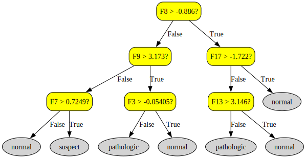
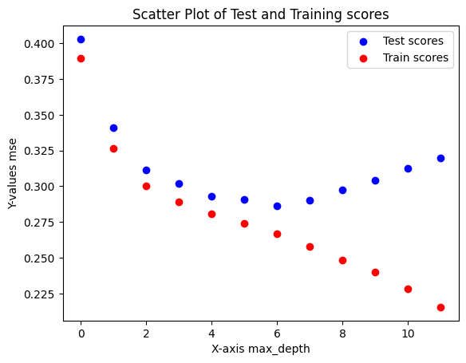

# Programming assigment 1

Group 5: Samuel Kajava and Torbjörn Livén

## Task 1

When running the classifiers inlcuded in the examples from the assignment description, gradient boosting performed best of the bunch. We concluded this by comparing the aggregated results from each classifier.

To explain the gradient boosting classifier, we first discuss the concept of gradient boosting. Boosting is a method where you train a model several times while iteratively trying to correct the previous iteration. This process is described as a way of combining weak learners into strong ones [[1]](https://en.wikipedia.org/wiki/Boosting_(machine_learning)). Gradient boosting utilizes this concept by training each model to minmize the loss function first, followed by training a new model to minimize the gradient. This process successively adds predicitions to the ensemble. These predictions are done by regression trees and return the final predictions once the `criterion` hyperparameter is met. In our case, we used the default `friedman_mse` which measures the quality of the iteration by looking at "the mean squared error with improvement score by Friedman" [[2]](https://scikit-learn.org/stable/modules/generated/sklearn.ensemble.GradientBoostingClassifier.html).

## Task 2

After trying out some different max-depths, the best one we got was a max-depth of 7, with an accuracy of `0.9178403755868545`.

For the tree visualization, a max-depth of 3 was selected.

<b>Fig:</b> Decision tree produced by Graphviz with <code>max_depth=3</code>.

## Task 3

<!--
The regression model we chose and got the best score with, was the MLPRegressor. Which after some fine-tuning achieved a negative mse of `-0.0006478530592890497`.
The hyperparameters we set were: 
`learning_rate_init=0.03`
`max_iter=15000`
`hidden_layer_size=(200,10)`
we also set `early_stopping=True`
-->
The regression model we got the best reproducible score with was the `GradientBoostingRegressor`, which got a negative mse of `-0.2645212922213328`, without any additional hyperparameter fine-tuning.
The regressor works in similar fashion to its corresponding classifier. It works additively by first making a baseline, initial model, and fits the data on it. Then it calculates residuals from the current model and the actual data. Once done calculating, a new model is formed to improve the previous one, the steps are repeated until a stopping criterion is met.
It should be noted that the gradient boosting is based on minimizing the loss function which measures how well the model fits the data, which is important in evaluating how well the model performs.

## Task 4

Step 2: Considering the data generating function we want a regression tree to predict the output from the input. We dont want to simply classify
the data into two classes, we want a value.

Nothing happens if we give it a bigger depth, the tree is only 1 node deep, even if we change the max_depth to a large value, the resulting model will still only be 1 node deep, due to how the data is distributed.  

Step 3: We trained a tree regression model with `max_depth=6` and achieved a negative mse of `-0.2806332424585957`

Step 4: In the plot, we can see that the model is overfitting on the training set. The evalutation on the test set keeps improving until
around `max_depth=6`, then the evaluation score really starts to diverge and we can see that it overfits on the training data because it gets better at the training set, but worse on the test set.
